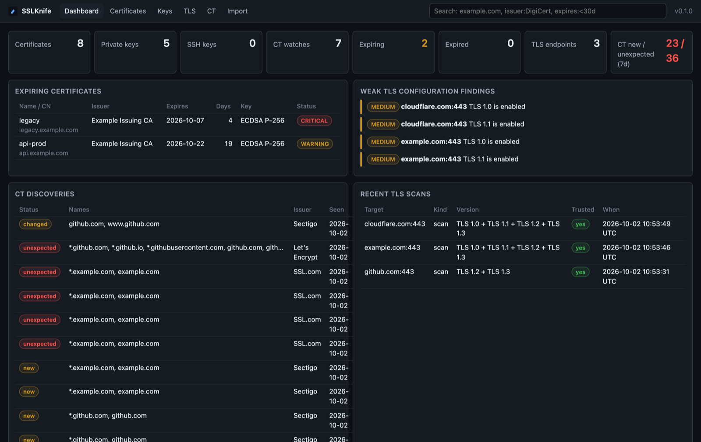
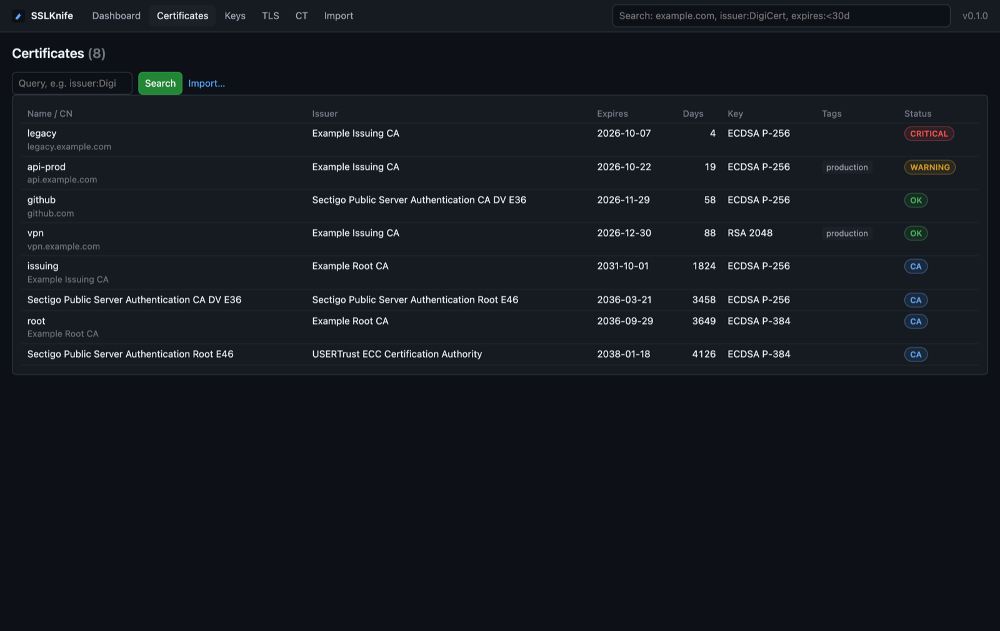
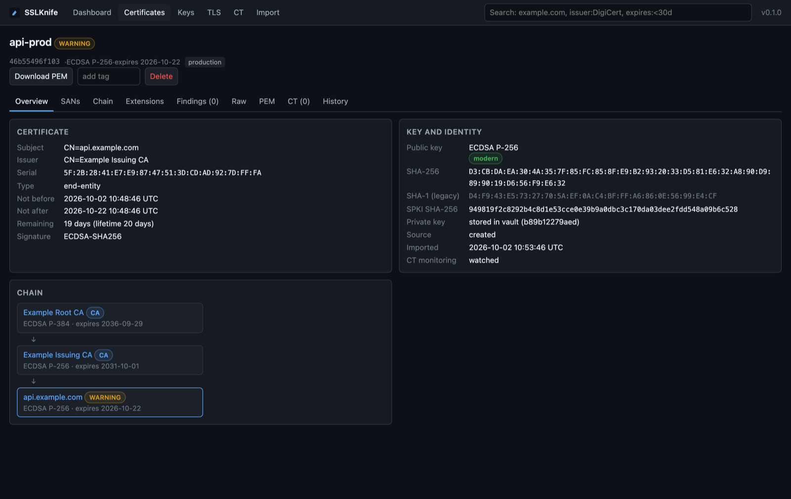
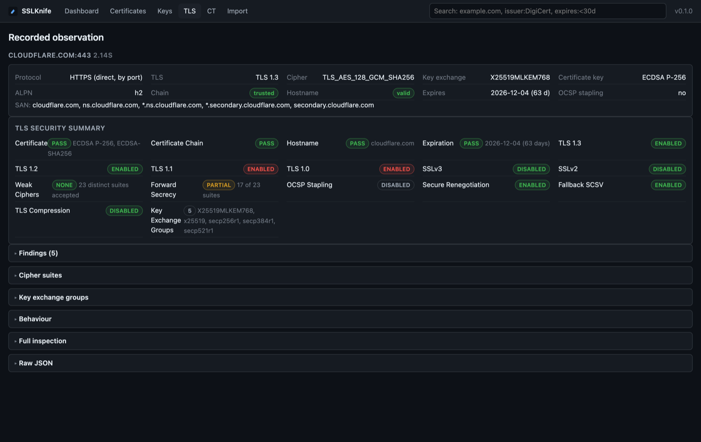

# SSLKnife

One tool for everyday TLS, X.509, PKI and SSH work: inspect and lint
certificates, run a private CA, convert between key and keystore formats
(including Java JKS without `keytool`), scan TLS servers, watch Certificate
Transparency, and keep everything in a local encrypted inventory with an
optional web UI. It is a single static Go binary and does not need OpenSSL.

> **Who is it for?** SSLKnife is built for hackers, nerds, developers and
> system engineers who live in a terminal. If you need an enterprise
> certificate management platform with teams, policies, discovery at scale
> and support, we strongly recommend [SSLeek](https://ssleek.com).



## Install

**Homebrew** (macOS and Linux):

```sh
brew install matusso/tap/sslknife
brew upgrade sslknife        # later, to get the newest release
```

**Go** (1.27+), latest or a specific version:

```sh
go install github.com/matusso/sslknife@latest
go install github.com/matusso/sslknife@v0.1.0
```

**Docker** (server mode):

```sh
docker run --rm -it -v sslknife-data:/data ghcr.io/matusso/sslknife init
docker run -p 127.0.0.1:8443:8443 -v sslknife-data:/data -it ghcr.io/matusso/sslknife
```

**Binaries** for Linux, macOS and Windows (amd64/arm64) are on the
[releases page](https://github.com/matusso/sslknife/releases), with SBOMs and
a Sigstore-signed checksum file.

## Use

Working with files and remote hosts needs no setup:

```sh
sslknife cert inspect fullchain.pem            # what is in this file?
sslknife cert inspect github.com:443           # what does this server present?
sslknife cert expires cert.pem --check 30d     # exit 5 if it expires within 30 days
sslknife tls scan example.com                  # protocols, ciphers, chain, findings
sslknife convert keystore.jks --to pkcs12      # any format to any other
sslknife ssh inspect ~/.ssh/id_ed25519.pub
```

To keep certificates and keys, create an encrypted vault once:

```sh
sslknife init                                  # asks for a vault password
sslknife init --touch-id                       # macOS: unlock with Touch ID or Apple Watch
sslknife cert import fullchain.pem --name api-prod --tag production
sslknife cert list
sslknife cert expiring --within 90d
sslknife ct watch '*.example.com'              # alert on unexpected issuance
sslknife vault unlock --for 30m                # no password prompts for a while
```

Run a small private CA:

```sh
sslknife cert create --type root-ca --cn "Example Root CA" --store --name root
sslknife cert create --type intermediate-ca --cn "Example Issuing CA" --ca root --store --name issuing
sslknife cert create --cn api.example.com --ca issuing --validity 90d
```

Open the web UI on the same inventory:

```sh
sslknife server                                # prints https://127.0.0.1:8443/?token=…
```

| Certificates | Certificate detail | TLS scan |
|---|---|---|
|  |  |  |

Every command has examples in `--help`. Add `--json` or `--yaml` for
scripting.

## Documentation

Guides, reference and design notes are in [`docs/`](docs/README.md).

## License

MIT, see [LICENSE](LICENSE).
